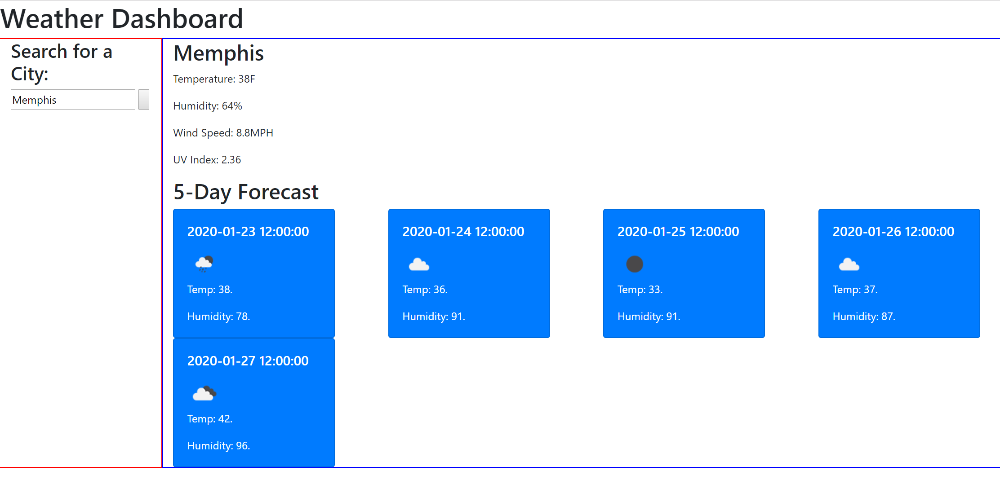

# weatherdashboard

As a professional, I'd like to view the weather for cities I'm traveling to for work

Return weather for city input

Return weather for city based on previous searched city

Local storage for cities 
